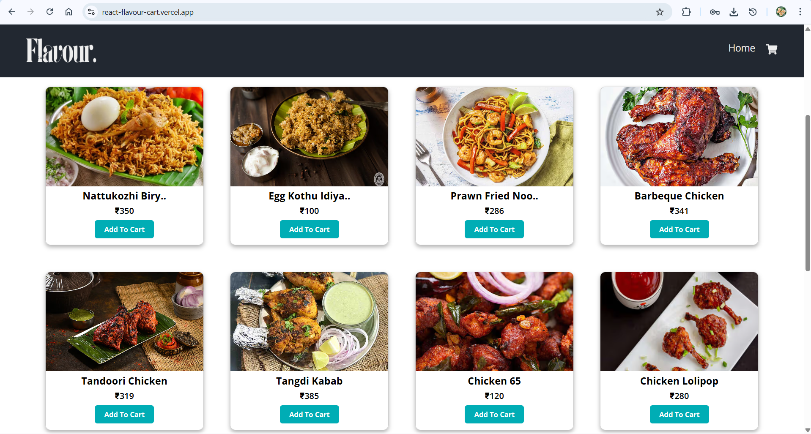

# React FlavourCart

A shopping cart app built with **React**.
It allows users to add or remove items to the cart, and view real-time cart totals.

## 🌐 Live Demo
Check out the live version of this project [here](https://react-flavour-cart.vercel.app/).

## 🚀 Features
- Display product listings dynamically from JSON data.
- Add, remove, and update items in the shopping cart.
- Real-time price calculation
- Built with **React Hooks**

## 📸 Preview


## 🛠️ Technologies Used
- **React.js**  
- **JavaScript**  
- **HTML5**  
- **CSS3**  
- **Vite**
- **Prettier**

## 📦 Installation
```bash
git clone https://github.com/osvi-25/react-FlavourCart.git
cd react-FlavourCart
npm install
npm start
```


